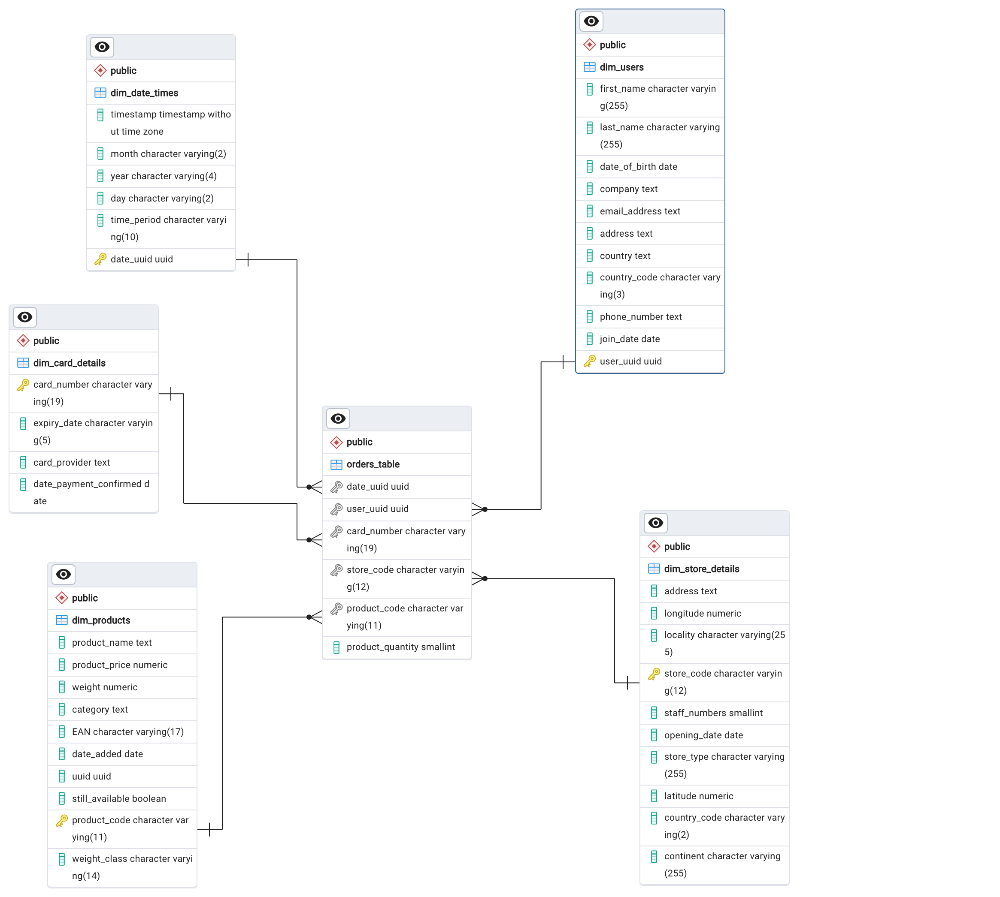

# AiCore-MRDC
AiCore Multi-National Retail Data Centralisation Project

## Table of Contents

- [AiCore-MRDC](#aicore-mrdc)
  - [Table of Contents](#table-of-contents)
  - [Project Description](#project-description)
    - [Objective](#objective)
      - [1. Database Setup](#1-database-setup)
      - [2. Data Retrieval](#2-data-retrieval)
      - [3. Data Cleaning](#3-data-cleaning)
      - [4. Data Integration](#4-data-integration)
    - [Database Structure](#database-structure)
    - [Establishing Relationships](#establishing-relationships)
  - [File structure of the project](#file-structure-of-the-project)
    - [Milestone2](#milestone2)
    - [Milestone3](#milestone3)
    - [Milestone4](#milestone4)
    - [Figures](#figures)
  - [Usage instructions](#usage-instructions)
  - [License information](#license-information)

## Project Description

A multinational company sells a diverse range of goods across the globe. However, its sales data are initially scattered across multiple sources, making them difficult to access and analyse effectively. To support a more data-driven approach, the organisation aims to consolidate this data into a single, centralised system.

### Objective

The first step is to retrieve and centralise the distributed sales data into a structured PostgreSQL database named sales_data. This process involves several key stages:
#### 1.	Database Setup
- Create a local PostgreSQL database called sales_data.
#### 2.	Data Retrieval
- Extract source data from AWS RDS and AWS S3 buckets.
- Load the data into Python using Pandas, resulting in several dataframes.
#### 3.	Data Cleaning
- Remove null values and duplicate records.
- Eliminate columns containing no useful information.
- Convert time-related fields to datetime format.
- Filter out erroneous records.
- Strip whitespace and remove non-numeric characters from numeric columns.
#### 4.	Data Integration
- Insert the cleaned dataframes as tables into the sales_data database.

### Database Structure

The resulting database will consist of six tables:
- A central **orders_table**
- Five supporting **dimension tables (dim_)**, which provide additional context:

| Table Name         | Description                          |
|--------------------|--------------------------------------|
| `dim_date_times`   | Dates and times of orders            |
| `dim_users`        | User/customer information            |
| `dim_card_details` | Payment card information             |
| `dim_products`     | Product details                      |
| `dim_store_details`| Store information                    |

### Establishing Relationships

To create a fully relational database structure, the following steps are carried out:
- Data Type Harmonisation
	- Ensure consistent column datatypes across all tables to enable seamless joins.
- Primary Key Assignment
	- Define primary keys in each of the dim_ tables.
- Foreign Key Mapping
	- Link the relevant columns in the orders_table to their corresponding entries in the dim_ tables using foreign keys.
 

The resulting relational sales_data database has a star structure, with the central orders_table connected radially to each of the dimension tables:

The database is now able to be queried to reveal business metrics.

## File structure of the project

The project is comprised of 4 folders, as follows:
<pre>
<code>
AiCore-MRDC/
├── requirements.txt
├── figures
│   └── sales_data_erd.png
├── LICENSE
├── milestone2
│   ├── data_cleaning.py
│   ├── data_extraction.py
│   ├── database_utils.py
│   ├── example_of_use.ipynb
├── milestone3
│   ├── dim_card_details.sql
│   ├── dim_date_times.sql
│   ├── dim_products.sql
│   ├── dim_store_details.sql
│   ├── dim_users.sql
│   ├── orders_table.sql
│   └── sales_data.pgerd
├── milestone4
│   ├── avg_interval_between_orders_by_year.sql
│   ├── month_with_highest_sales_per_year.sql
│   ├── sales_per_german_store_type.sql
│   ├── sales_per_month.sql
│   ├── sales_percentage_vs_store_type.sql
│   ├── staff_per_country.sql
│   ├── stores_per_country.sql
│   ├── stores_per_locality.sql
│   └── web_sales_vs_outlet_sales.sql
</code>
</pre>
### Milestone2

Python code for the project, which is structured into files, classes, and methods, as follows:

- database_utils.py
    - class DatabaseConnector():
      - methods to connect-to, read-from, and upload-to AWS RDS and PostgreSQL databases, as follows:
        - read_db_creds(): reads a credentials yaml file and returns a dictionary of the credentials
        - init_db_engine(): uses the credentials from read_db_creds and initialises and returns an sqlalchemy database engine
        - list_db_tables(): using the database engine, returns a list of tables in the database
        - upload_to_db(): uploads a pandas dataframe to a SQL database table
        
- data_extraction.py
    - class DataExtractor():
      - methods to extract data from a variety of sources, and return as pandas dataframes, as follows:
        - read_rds_table(): reads a table from the database and returns it as a pandas dataframe
        - read_csv_table(): reads a csv file and returns it as a pandas dataframe
        - retrieve_pdf_data(): extracts all tables from all pages of a PDF and returns them as a pandas dataframe
        - list_number_of_stores(): returns the number of unique stores in a table
        - retrieve_stores_data(): reads the stores data from a CSV file and returns it as a pandas dataframe
        - extract_from_s3(): extracts data from an S3 bucket and returns it as a pandas dataframe
        - extract_json_from_url(): extracts data from a JSON file and returns it as a pandas dataframe

- data_cleaning.py
    - class DataCleaning():
      - methods to clean pandas dataframes, as follows:
        - clean_user_data(): clean user data by removing null values, and converting date columns to datetime
        - clean_card_data(): clean card data by removing nulls and duplicates, filling missing values and converting date columns to datetime
        - called_clean_store_data(): clean store data by removing columns containing no useful information, 
        converting dates to datetime, removing non-numeric characters from staff-numbers, and removing nulls
        - convert_product_weights(): convert product weights to decimal numbers in kg
        - clean_products_data(): clean product data by removing nulls and columns containing no useful information
        - clean_orders_data(): clean orders data by removing columns containing no useful information
        - clean_date_events(): clean date events data by removing duplicates, converting time column to datetime,
        and converting date columns to numeric format

### Milestone3

SQL scripts to harmonise and connect the 5 dimension tables to the central orders_table:
- orders_table.sql
  - ensures that the orders_table harmonises with the data types of the other tables in the database.
- dim_users.sql
  - performs data type harmonisation of the 'dim_users' table columns.
- dim_store_details.sql
  - performs data type harmonisation of the 'dim_store_details' table columns.
- dim_products.sql
  - performs data type harmonisation of the 'dim_products' table columns.
- dim_date_times.sql
  - performs data type harmonisation of the 'dim_date_times' table columns.
- dim_card_details.sql
  - performs data type harmonisation of the 'dim_card_details' table columns.

Entity Relationship Diagram in PGERD format: sales_data.pgerd

### Milestone4

Examples of SQL scripts to perform business analytics:

- month_with_highest_sales_per_year.sql
  - retrieves the month with the highest sales for each year from the orders table.
- sales_per_german_store_type.sql
  - calculates the total sales for each store type in Germany.
- sales_per_month.sql
  - calculates the total sales for each month by joining the orders_table with the dim_products and dim_date_times tables.
- sales_percentage_vs_store_type.sql
  - calculates the percentage of total sales made by each store type.
- staff_per_country.sql
  - query retrieves the total number of staff members for each country from the dim_store_details table.
- stores_per_country.sql
  - query retrieves the total number of stores in each country from the dim_store_details table.
- stores_per_locality.sql
  - query retrieves the number of stores in each locality from the dim_store_details table.
- web_sales_vs_outlet_sales.sql
  - query compares the number of sales and product quantities sold through the web portal and offline stores.
- avg_interval_between_orders_by_year.sql
  - calculates the average time difference between consecutive orders, grouped by year, and expresses the result in hours, minutes, seconds, and milliseconds.

### Figures

Contains an image showing the database structure in PNG format: **sales_data_erd.png**

### Installation

1. Clone the repository:
<pre>
	git clone https://github.com/KevDocherty/AiCore-MRDC.git
</pre>

2. cd into the new directory:
<pre>
	cd AiCore-MRDC
</pre>

3. setup a new virtual environment:
<pre>
	pyenv virtualenv myenv-name
	pyenv activate myenv-name
</pre>

4. install dependencies:
<pre>
	pip install -r requirements.txt
</pre>

### Usage

Please refer to the Jupyter Notebook **example_of_use.ipynb**, in the **milestone2** folder, for examples of how to use the Python code.

The Python code and SQL scripts also contain docstrings providing further details of their functionality.

## License information

MIT Licence
