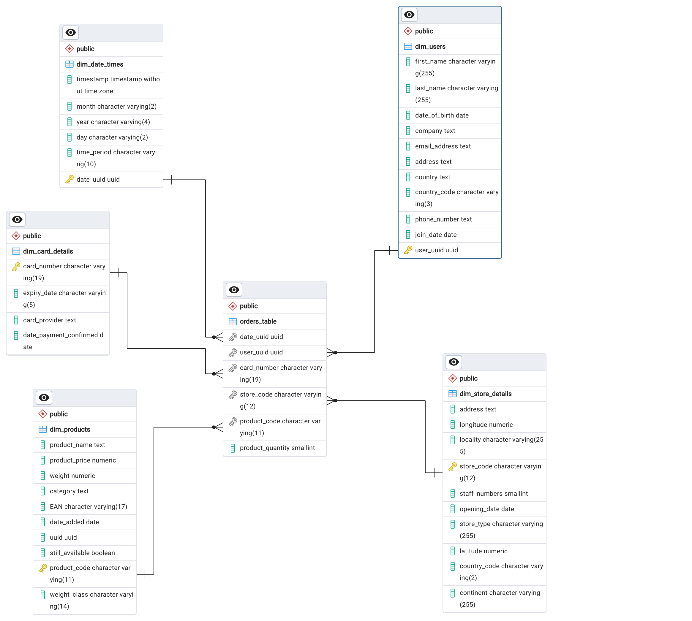

# AiCore-MRDC
AiCore Multi-National Retail Data Centralisation project

## Table of Contents 

## Project Description

A multinational company sells various goods across the globe. 

Their sales data are initially spread across many different data sources making them not easily accessible or analysable. To become more data-driven, the organisation would like to make its sales data accessible from one centralised location.

The first task is therefore to retrieve the distributed sales data and add as tables to a centralised database, involving the following stages:

- creation of a local PostgreSQL database called 'sales_data'
- retrieval of source data from AWS RDS / AWS S3 buckets, and saving as Pandas Dataframes
- cleaning of the dataframes to remove null values and duplicates, remove columns containing no useful information, convert time data to datetime format, remove erroneous records, and remove whitespaces and non-numeric characters from numeric data
- adding the resulting cleaned tables to the sales_data database.

The sales_data database will now comprise 6 tables, with a central 'orders_table' and 5 dimension ('dim') tables providing further details about each of the orders, as follows:

- dim_date_times: dates and times of orders
- dim_users: user details
- dim_card_details: credit card details
- dim_products: product details
- dim_store_details: details of the various stores selling the products.

Connection of the tables to create a relational database, via the following steps:

- harmonisation of column datatypes across the various tables, to facilitate connection
- creation of primary keys in the 'dim' tables
- connection of each column of the orders_table to its equivalent in the dim tables via creation of foreign keys in the orders_table.

The resulting relational sales_data database has a star structure, with the central orders_table connected radially to each of the dim tables:

The database is now able to be queried, to reveal business metrics.

## File structure of the project

The project is comprised of 3 folders, as follows:

### Milestone2

Python code for the project, which is structured into files, classes, and methods, as follows:

- database_utils.py
    - class DatabaseConnector(): methods to connect-to, read-from, and upload-to AWS RDS and PostgreSQL databases
        - read_db_creds(): reads a credentials yaml file and returns a dictionary of the credentials
        - init_db_engine(): uses the credentials from read_db_creds and initialises and returns an sqlalchemy database engine
        - list_db_tables(): using the database engine, returns a list of tables in the database
        - upload_to_db(): uploads a pandas dataframe to a SQL database table
        
- data_extraction.py
    - class DataExtractor(): methods to extract data from a variety of sources, and return as pandas dataframes
        - read_rds_table(): reads a table from the database and returns it as a pandas dataframe
        - read_csv_table(): reads a csv file and returns it as a pandas dataframe
        - retrieve_pdf_data(): extracts all tables from all pages of a PDF and returns them as a pandas dataframe
        - list_number_of_stores(): returns the number of unique stores in a table
        - retrieve_stores_data(): reads the stores data from a CSV file and returns it as a pandas dataframe
        - extract_from_s3(): extracts data from an S3 bucket and returns it as a pandas dataframe
        - extract_json_from_url(): extracts data from a JSON file and returns it as a pandas dataframe

- data_cleaning.py
    - class DataCleaning(): methods to clean pandas dataframes
        - clean_user_data(): clean user data by removing null values, and converting date columns to datetime
        - clean_card_data(): clean card data by removing nulls and duplicates, filling missing values and converting date columns to datetime
        - called_clean_store_data(): clean store data by removing columns containing no useful information, 
        converting dates to datetime, removing non-numeric characters from staff-numbers, and removing nulls
        - convert_product_weights(): convert product weights to decimal numbers in kg
        - clean_products_data(): clean product data by removing nulls and columns containing no useful information
        - clean_orders_data(): clean orders data by removing columns containing no useful information
        - clean_date_events(): clean date events data by removing duplicates, converting time column to datetime,
        and converting date columns to numeric format

### Milestone3

SQL scripts to tidy up and connect the 5 dimension tables to the central orders_table. 
ERD files.

### Milestone4

Examples of SQL scripts to perform business analytics.
 

## Installation instructions

## Usage instructions

## License information

MIT Licence
